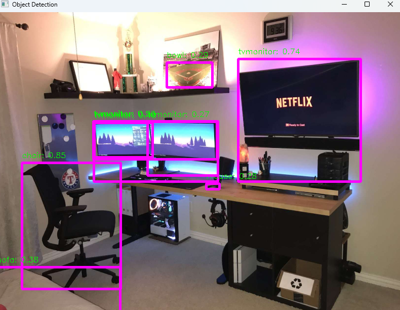
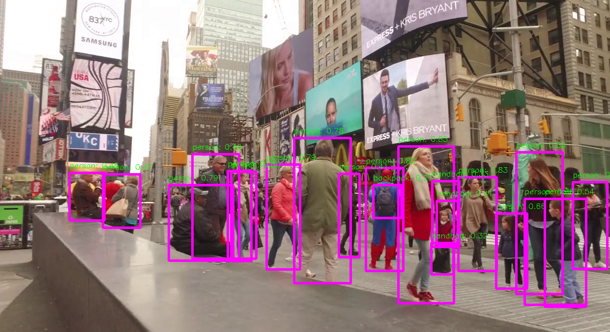

---

````markdown
# Real-Time Object Detection

This project demonstrates real-time object detection using the YOLO (You Only Look Once) model. It allows you to perform object detection on both image and video files, drawing bounding boxes around detected objects along with their class labels and confidence scores.

## Table of Contents

- [Installation](#installation)
- [Usage](#usage)
- [Project Structure](#project-structure)
- [Requirements](#requirements)
- [License](#license)

## Installation

To run this project locally, follow these steps:

1. Clone the repository to your local machine:

   ```bash
   git clone https://github.com/ShyamSanjeyS/Real-Time-Object-Detection-Iamge-Video.git
   cd Real-Time-Object-Detection
````

2. Create and activate a virtual environment (optional but recommended):

   ```bash
   python -m venv venv
   venv\Scripts\activate  # Windows
   ```

3. Install the required Python packages using pip:

   ```bash
   pip install -r requirements.txt
   ```

## Usage

1. Make sure you have your image file (e.g., `img1.jpg`) or video file (e.g., `video1.mp4`), and class names file (`classes.txt`) in the `data/` directory. You can customize these files as needed.

2. Run the object detection script from the project root:

   ```bash
   python main.py
   ```

3. When prompted, enter `image` or `video` depending on the input you want to process.

4. The object detection results will be displayed in a resizable `Object Detection` window.

   * For image: Press any key to close the window.
   * For video: Press `q` to quit.

## Project Structure

The project follows this directory structure:

```
Real-Time-Object-Detection/
│
├── data/
│   ├── img1.jpg
│   ├── video1.mp4
│   ├── classes.txt
│   └── yolo-Weights/
│       └── yolov8n.pt
│
├── src/
│   ├── __init__.py
│   ├── object_detection_image.py
│   ├── object_detection_video.py
│   └── utils.py
│
├── requirements.txt
├── README.md
└── main.py
```

* `data/`: Contains image, video, weights, and class name files.
* `src/`: Contains separate scripts for image and video object detection.
* `main.py`: Entry point that allows choosing between image and video detection.
* `requirements.txt`: Lists project dependencies.

## Requirements

* Python 3.x
* OpenCV (`opencv-python`)
* Ultralytics (`ultralytics`)

You can install the required packages using pip as shown in the installation section.

## Sample Output

Here are sample outputs from the object detection system:

### 🔹 Image Detection



---

### 🔹 Video Detection (Sample Frame)



## License

This project is licensed under the MIT License - see the LICENSE file for details.

```

---


